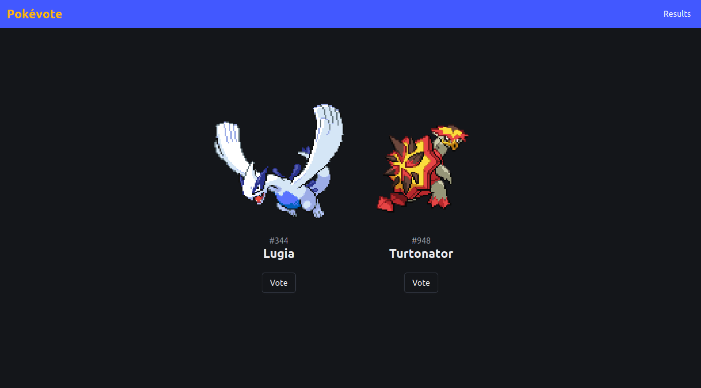

# Pokévote

Pokévote is a web application where users can vote on their favourite Pokémon! It displays two random Pokémon, and users can cast their votes based on preference.

This project was created as a way to learn and experiment with [htmx](https://htmx.org/) for handling server-client interactions in a web application.



## Overview

- **Golang**: Backend server and HTML rendering using the standard library.
    - Uses **Golang templates** to render HTML pages on the server side.
- **SQLite**: Local database for storing Pokémon data.
    - **PokéAPI**: Source of Pokémon data.
- **htmx**: Server-client communication is implemented using **htmx**, which enables partial page updates by sending HTTP requests to the server and dynamically replacing HTML fragments.

## Getting Started

### Prerequisites

- Go 1.20+
- SQLite 3.0+
- `htmx` included in the HTML templates.

### Installation

1. Install dependencies:

   ```bash
   go mod download
   ```

2. Seed the database with Pokémon data using the `Makefile`:

   ```bash
   # NOTE: the script is synchronous for simplification purposes.
   make seed
   ```

3. Run the application:

   ```bash
   make run
   ```

4. Open your browser and visit [http://localhost:2727](http://localhost:2727).

### Additional Makefile Commands

- **Build the binary**:

   ```bash
   make build
   ```

   This will create the binary `pokevote` in the `bin` directory.

- **Clean build artifacts**:

   ```bash
   make clean
   ```

   This will remove the `bin` directory and clean up any build-related files.
